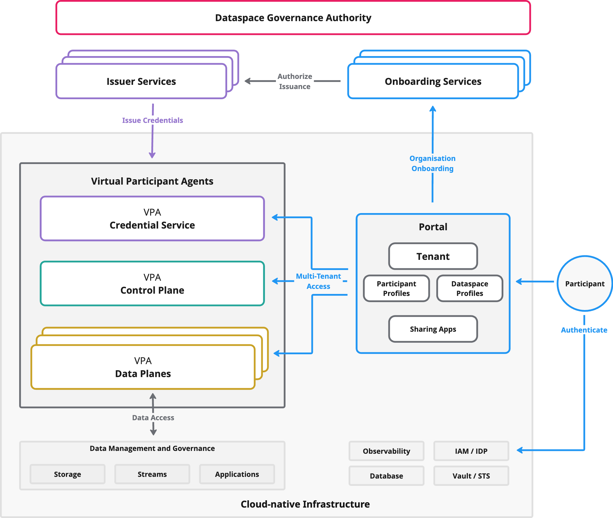
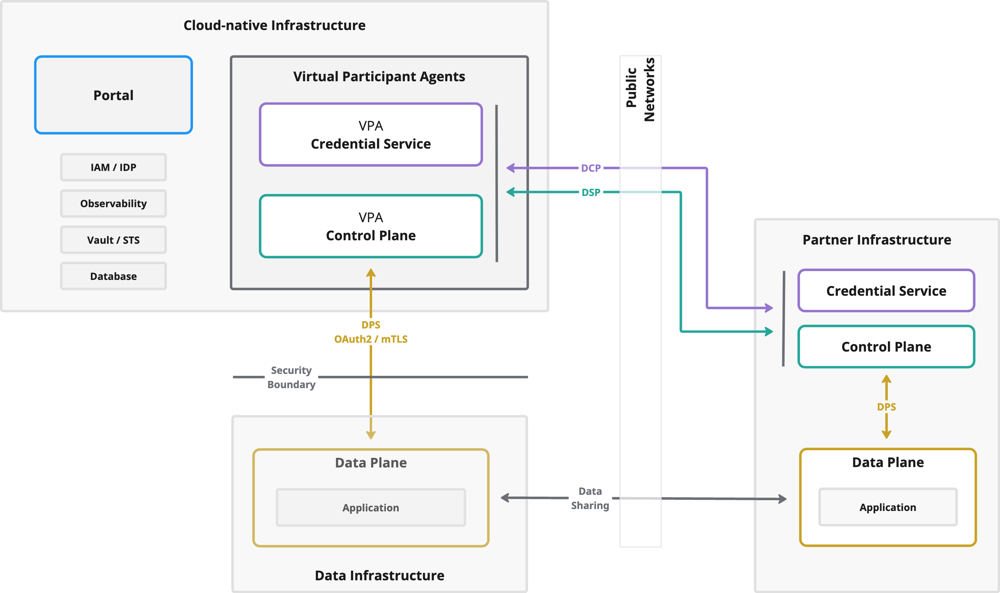

This is Part 2 of the multi-tenant series:

- Part 1: [Architecture for Multi-Tenant Dataspace Environments](/blog/20260206-architecture-multi-tenant-dataspace-environments/)
- Part 2: **Participant perspective** (this post)

Part 1 explained **what you operate** (cells, VPAs, and CFM). This post explains what your **customers experience**: how governance, onboarding, and authentication connect to day-to-day workflows in a hosted dataspace environment.

For the documentation entry point, see [Multi-Tenant Deployments](/documentation/for-adopters/multi-tenant-deployments/).

## Platform from the tenant’s view

From the tenant’s point of view, the platform is a thin product surface on top of a governance-defined trust framework and a protocol-driven runtime.

| Layer | What the tenant experiences | What it means for your product |
| --- | --- | --- |
| Dataspace Governance Authority | Rules, onboarding, issuers, compliance gates | You integrate; you don’t arbitrate membership |
| EDC-V runtime | Catalog, negotiation, identity proofs, data flow execution | You provide runtime primitives with service virtualization |
| Portal | Self-service workflows and configuration | The product surface tenants use day-to-day |

## The governance layer

In standards terms, a dataspace governance framework defines joining requirements and trust semantics (membership rules, required credentials, shared semantics, and minimal interoperability constraints). The **Dataspace Governance Authority (DSGA)** is a functional role that maintains that framework.

The operational boundary to keep explicit:

> Governance defines and authorizes participation.  
> The platform provisions the technical context and executes the runtime protocols.

In practice, dataspace membership is expressed as **credentials** (for example W3C verifiable credentials). Many dataspaces rely on **multiple** onboarding and issuer services to avoid implicit central dependencies.

| Service | Purpose | Typical operator |
| --- | --- | --- |
| Onboarding service | Business verification, legal agreements, compliance checks | Governance-recognized provider (acting on behalf of the DSGA) |
| Issuer service | Issue verifiable credentials after approval | Governance-recognized provider (acting on behalf of the DSGA) |

## The onboarding journey

A useful onboarding model has six stages:

1. Application to a governance-recognized onboarding service
2. Verification (legal/compliance/business checks)
3. Tenant provisioning in the platform (participant context + baseline configuration)
4. Credential issuance by an issuer service, delivered to the tenant’s credential service
5. Configuration (assets, policies, sharing apps, data plane connectivity)
6. Active participation (catalog discovery, negotiation, transfers)

The key split is stages 1–2 vs 3–4: governance verifies and authorizes issuance, while the platform provisions the tenant context that receives credentials and enables participation.

## The portal

The portal is an opinionated view over the service virtualization model. Typically only the portal’s backend is internet-facing; it holds machine credentials and calls administration APIs on behalf of authenticated users.

A practical concept hierarchy for the portal looks like this:

| Concept | Description |
| --- | --- |
| Tenant | The organization (customer relationship, billing/support boundary) |
| Participant profiles | Participant identity contexts (for example DID-backed). Multiple profiles per tenant are common |
| Dataspace profiles | Per-dataspace configuration: trust requirements, protocol versioning, semantics alignment |
| Sharing apps | Business applications that discover catalogs, negotiate agreements, and initiate/consume data flows |

Reference implementations for the “portal + backend” layer:

- Cloud-provider UI backend: [Metaform/redline](https://github.com/Metaform/redline)
- End-user onboarding GUI (SME onboarding demonstrator): [FraunhoferISST/End-User-API](https://github.com/FraunhoferISST/End-User-API)

## Runtime touchpoints and administration APIs

Under the hood, portal backends and automation typically interact with a small set of administration APIs. These APIs are designed for **machine clients** (automation and UI backends), not direct human use.

| Name | Exposed by | Purpose | Auth |
| --- | --- | --- | --- |
| Management API | Control Plane | Manage assets, policies, contracts | OAuth2 |
| Identity API | Identity Hub / Credential Service | Manage DIDs, key pairs, verifiable credentials | OAuth2 |
| Issuer Admin API | Issuer service | Manage holders, attestations, definitions; issuer tenants | OAuth2 |
| Observability APIs | All components | Readiness/health endpoints | varies |
| Federated Catalog API (optional) | Control Plane | Query federated catalog | OAuth2 |

## Authentication and access control

Humans authenticate to the portal. The portal backend and platform automation use **machine credentials** to call administration APIs on behalf of a participant context.

EDC-V administration APIs commonly distinguish these roles:

- **admin**: emergency/initial setup
- **provisioner**: onboarding and context/VPA management (automation)
- **participant**: day-2 tenant operations within a participant context

Two token claims are especially important for correctness:

- `role`: one of `admin`, `provisioner`, `participant`
- `participant_context_id`: identifies the participant context the client acts for

Treat `participant_context_id` as the security unit for both API access and operational troubleshooting.

## How data sharing works

When a counterparty requests access to your data, three protocols execute in sequence:

1. **DCP**: identity proofs between credential services
2. **DSP**: catalog discovery and contract negotiation between control planes
3. **DPS**: signaling from control plane to data plane to start the transfer

> **DCP proves the parties, DSP proves the agreement, DPS drives the execution.**

After that, the actual bytes move over wire protocols (HTTP, S3, streaming, industrial protocols) between data planes.

As a participant, you don’t implement these protocols—your hosted VPA runtime handles them. What you control is:

- **What** you offer or request (assets, policies, catalog configuration via the Management API)
- **Who** you trust (credentials and policy rules via the Credential Service)
- **Where** data moves (data plane placement and connectivity)

For details, see:

- DCP: [spec](https://eclipse-dataspace-dcp.github.io/decentralized-claims-protocol/)
- DSP: [spec](https://eclipse-dataspace-protocol-base.github.io/DataspaceProtocol/)
- DPS: [Data Plane Signaling docs](/documentation/for-contributors/data-plane/data-plane-signaling/) and [why DPS matters](/blog/20260126-data-plane-signaling/)

To validate interoperability across implementations, use the conformance suites: [DCP TCK](https://github.com/eclipse-dataspacetck/dcp-tck), [DSP TCK](https://github.com/eclipse-dataspacetck/dsp-tck).

## Data plane deployment from the participant’s view

In a multi-tenant environment, the control plane runs as part of the shared platform (your VPA). But data planes can be deployed **wherever makes sense for your data**: co-located with the platform for simplicity, or placed close to your data sources for latency, connectivity, or jurisdictional requirements.

Three transfer patterns show up repeatedly:

| Pattern | Direction | Typical use cases |
|---|---|---|
| Pull | Consumer fetches from provider | API access, on-demand queries |
| Push | Provider sends to consumer | Batch exports, event-driven delivery |
| Stream | Continuous flow until terminated | IoT sensors, telemetry |

For data sovereignty and edge scenarios, common deployment patterns include:

- **Factory/Site Edge**: data planes at each site, connected to local systems, with a unified catalog managed by the control plane.
- **Multi-Protocol Edge**: separate data planes for OPC-UA, S3, HTTP, and other protocols, all under one policy model.
- **Geographic Distribution**: data planes deployed in required regions to keep data within jurisdiction.

Running **multiple data planes** per participant is normal: per site, per protocol, per region, or per security boundary.

For details on how data planes register, communicate with the control plane, and how to build custom data planes, see the [Data Plane documentation](/documentation/for-adopters/data-plane/).

## Getting started

A practical learning path:

1. Deploy **JAD (Just Another Demonstrator)** for hands-on exploration: [Metaform/jad](https://github.com/Metaform/jad)
2. Study EDC-V’s architecture and security model: [EDC-V docs](https://github.com/eclipse-edc/Virtual-Connector/tree/main/docs)
3. Read CFM’s architecture and extension points: [CFM system architecture](https://github.com/Metaform/connector-fabric-manager/blob/main/docs/developer/architecture/system.architecture.md)
4. Sketch your own “cells + VPAs + trust boundary” diagram and validate it with SREs and architects

## Series recap

- Part 1: [Architecture for Multi-Tenant Dataspace Environments](/blog/20260206-architecture-multi-tenant-dataspace-environments/)
- Part 2: [Multi-Tenant EDC from a participant perspective](/blog/20260206-multi-tenant-edc-participant-perspective/)
- Docs entry point: [Multi-Tenant Deployments](/documentation/for-adopters/multi-tenant-deployments/)
