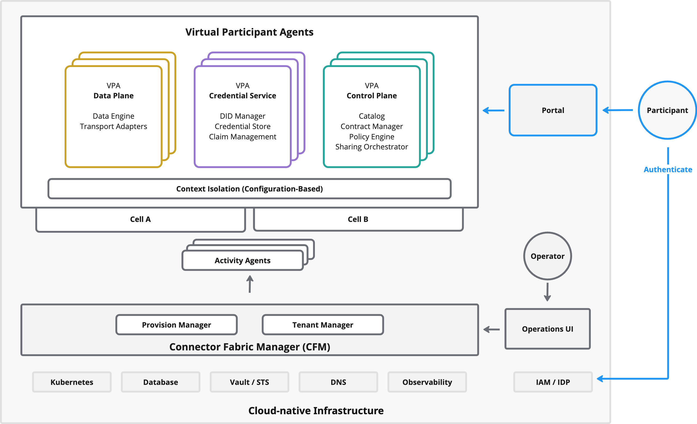

## When single-tenant isn't enough

The [Distributions, Deployment, and Operations](/documentation/for-adopters/distributions-deployment-operations/) chapter focuses on how a single organization builds and operates EDC components—from BOMs and distributions to deployment topologies and scaling.

If you are a **hosting provider**, **cloud platform team**, or **ecosystem operator** serving many participant organizations, a different operational model is needed: instead of deploying separate infrastructure per tenant, participant contexts are provisioned as lightweight, isolated units on shared runtime capacity.

This is enabled by **service virtualization**:

- **EDC-V (Virtual Connector)** turns EDC components into **multi-tenant runtimes**.
- **CFM (Connector Fabric Manager)** automates **tenant provisioning** and **Virtual Participant Agent (VPA)** lifecycle.

## The operational model at a glance

| Single-tenant deployment | Multi-tenant deployment |
|---|---|
| One connector = one process | One runtime serves many participants |
| Deploy infrastructure per tenant | Provision participant metadata (contexts) |
| Scale by adding containers | Scale by adding cells (capacity pools) |
| Manage operations per-tenant | Manage operations centrally |

## Key concepts

- **Virtual Participant Agent (VPA)**: the unit of runtime isolation—one participant’s context within a shared cell, covering Control Plane, Credential Service, and Data Plane functions.
- **Cell**: a homogeneous deployment zone (for example a Kubernetes cluster) that hosts many VPA contexts.
- **Connector Fabric Manager (CFM)**: the management plane that provisions tenant contexts and automates VPA lifecycle. CFM is **not** in the trust-decision path; live data sharing continues even during CFM downtime.

## Deep dives (blog series)

For the full architectural blueprint—platform operations, customer onboarding, and data plane deployment—see the blog series:

| Topic | Blog post |
|---|---|
| Platform architecture: CFM, VPAs, cells, operational boundaries | [Architecture for Multi-Tenant Dataspace Environments](/blog/20260206-architecture-multi-tenant-dataspace-environments/) |
| Participant perspective: governance, onboarding, portal, data plane deployment, protocols | [Multi-Tenant EDC from a participant perspective](/blog/20260206-multi-tenant-edc-participant-perspective/) |

## Project references

Multi-tenant deployments span several Eclipse projects. For low-level details, consult each project’s documentation:

| Project | Documentation |
|---|---|
| EDC (Control Plane, Identity Hub, Federated Catalog) | [Adopters Manual](/documentation/for-adopters/) |
| EDC-V (Virtual Connector) | [EDC-V docs](https://github.com/eclipse-edc/Virtual-Connector/tree/main/docs) |
| CFM (Connector Fabric Manager) | [CFM architecture](https://github.com/Metaform/connector-fabric-manager/blob/main/docs/developer/architecture/system.architecture.md) |
| Data Plane Core + SDKs | [Eclipse Data Plane Core](https://github.com/eclipse-dataplane-core) |

## Getting started

- Deploy **JAD (Just Another Demonstrator)** for hands-on exploration: [Metaform/jad](https://github.com/Metaform/jad)
- Study EDC-V’s architecture and security model (tasks, boundaries, access control): [EDC-V docs](https://github.com/eclipse-edc/Virtual-Connector/tree/main/docs)
